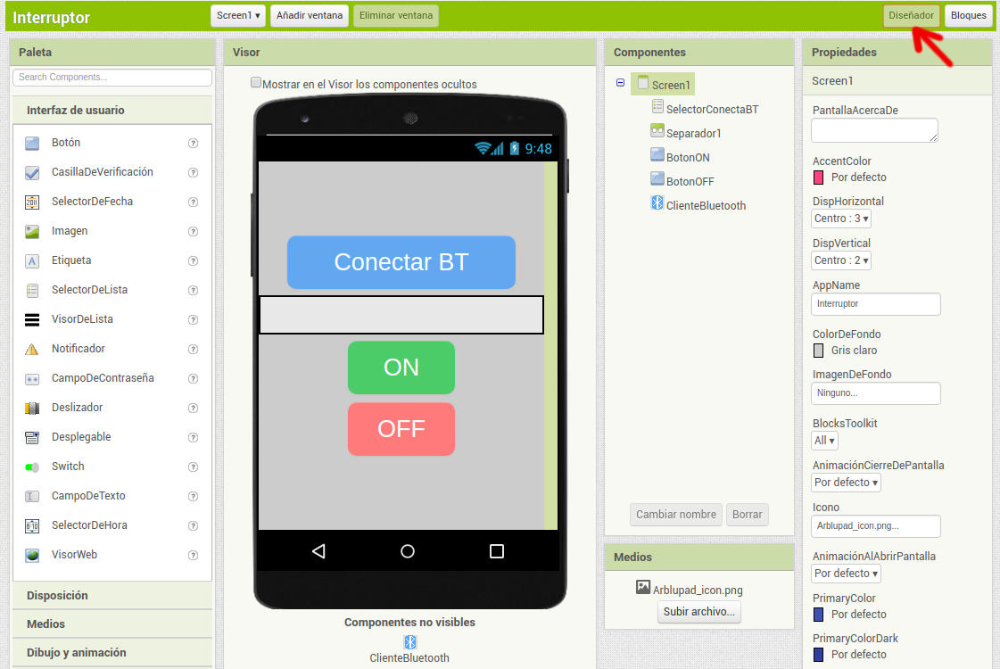
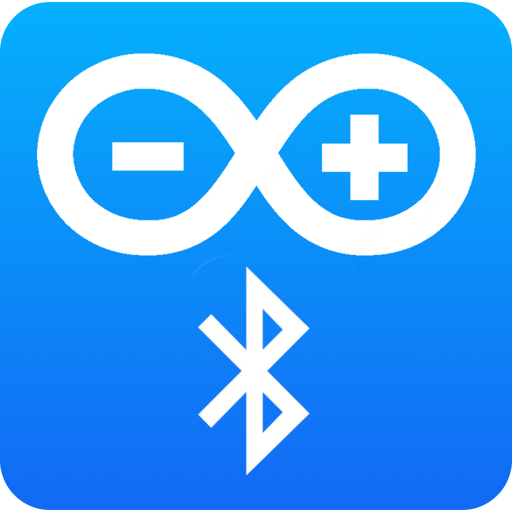
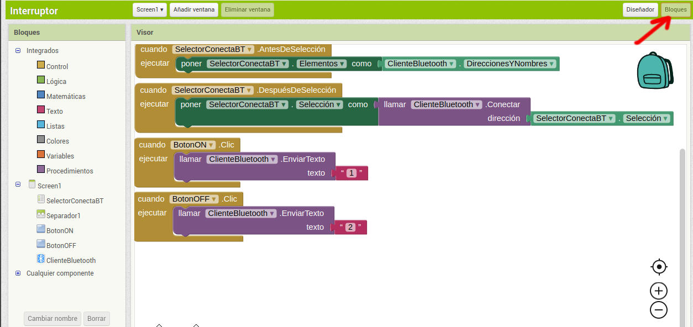
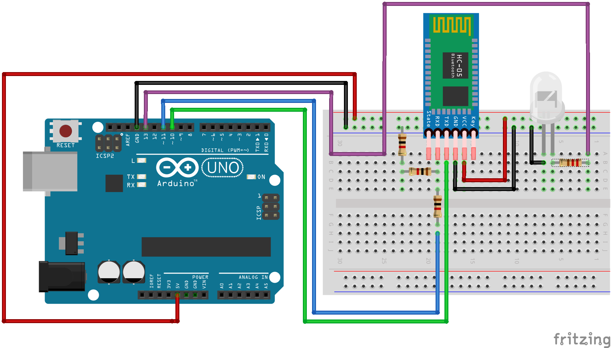

# Enciende o apaga un LED desde el móvil

El proyecto consiste en realizar un circuito con una luz que pueda ser encendida o apagada desde un teléfono móvil de forma inalámbrica mediante Bluetooth. La aplicación del teléfono la creamos con [App Inventor](https://appinventor.mit.edu).


Es recomendable tener conocimientos previos básicos de App Inventor y de programación en Arduino IDE.

## Materiales.

- 1 placa Arduino 
- 1 Protoboard
- 1 LED
- 1 resistencia de 330 Ω (naranja-naranja-marrón)
- 3 resistencias de 1 kΩ (marrón-negro-rojo)
- 1 Módulo HC-05 (también se puede hacer con el HC-06)
- Cables para las conexiones (latiguillos)

## Programación de la aplicación para Android con App Inventor.

Con la ayuda de la herramienta online [App Inventor](https://appinventor.mit.edu), a la que accedemos con nuestra cuenta de Google, vamos a realizar la aplicación para móviles o tablets Android con la que conectaremos a nuestro módulo de Bluetooth de Arduino y después podremos encender o apagar un LED a distancia de forma inalámbrica.

Los elementos que deberemos añadir en el "Diseñador" de App Inventor serán los que vemos en la imagen:



Podemos personalizar el icono de la aplicación, por ejemplo con esta imagen:



Los bloques de programación que añadiremos después son los siguientes:



El programa resultante lo podemos descargar en los siguientes enlaces:

- [Interruptor.aia](programas/AppInventor/Interruptor.aia): podemos importar este archivo desde la web de App Inventor para visualizarlo o editarlo.
- [Interruptor.apk](programas/AppInventor/Interruptor.apk): archivo para instalar la aplicación en el móvil o tablet Android.

## Montaje del circuito



La práctica se puede hacer con el módulo HC-06 o el módulo HC-05. La diferencia entre los dos componentes consiste en que el módulo HC-06 solamente puede trabajar en modo *Slave*, pudiendo trabajar el módulo HC-05 como *Master* o *Slave*.

## Programación de Arduino

Para configurar el módulo HC-05, por ejemplo para asignarle un nombre que lo identifique al conectarlo desde el teléfono o para establecer un pin, que por defecto suele ser "1234", podemos seguir un tutorial como el siguiente de la web [PROMETEC](https://www.prometec.net/bt-hc05/).

El programa en Arduino será el siguiente:

```arduino
#include <SoftwareSerial.h>

SoftwareSerial miBT(10,11);
int Data; //declaramos la variable de los datos enviados al bluetooth
int ledpin=13; // el LED se conecta en el pin 13
void setup(){
    Serial.begin(9600);
    Serial.println("Listo");
    miBT.begin(38400);
    pinMode(ledpin,OUTPUT);
}

void loop(){
  if (miBT.available())
  {  Data=miBT.read();
  if(Data=='1')
       {   
          digitalWrite(ledpin,1); //Que se encienda el LED
       }
         if (Data=='2')
       {
          digitalWrite(ledpin,0); //Que se apague el LED

       }
  }
  Serial.write(miBT.read()); //lee del BT y envia a Arduino

  if(Serial.available())
  miBT.write(Serial.read()); //lee de Arduino y envia a BT
}

```
